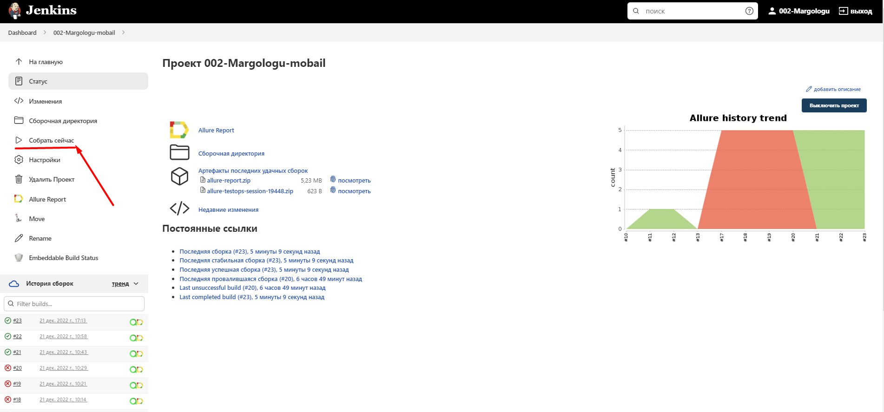
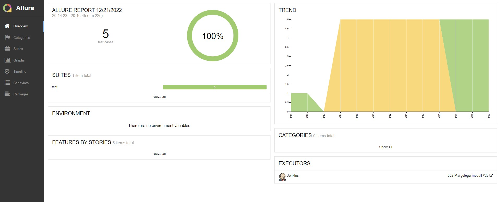
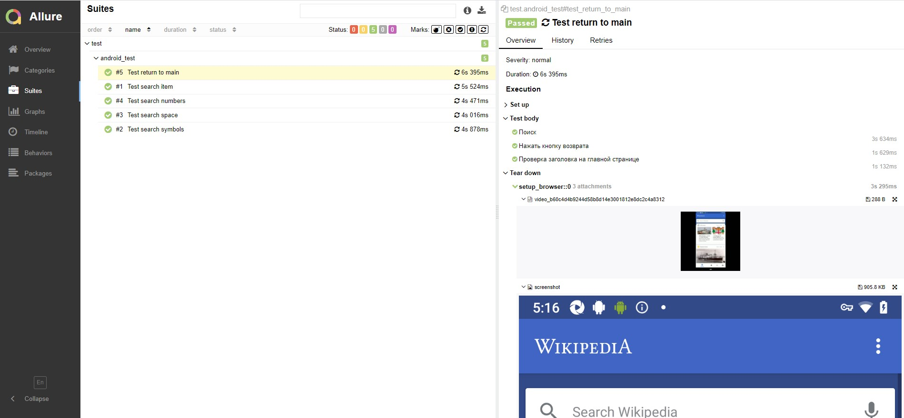
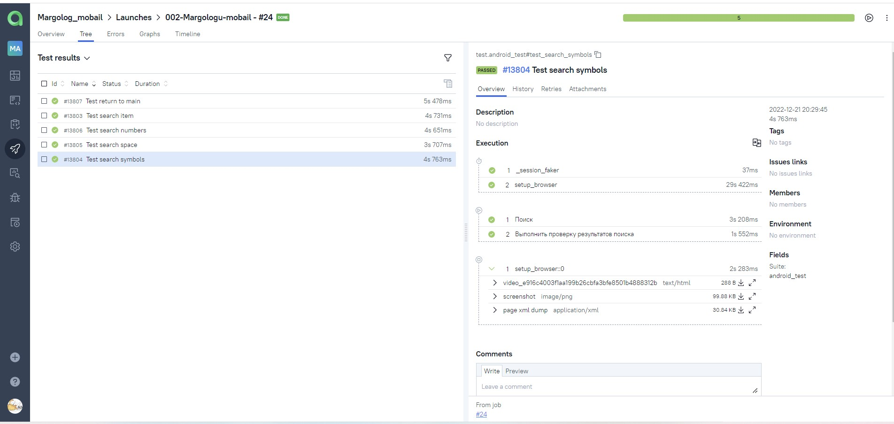
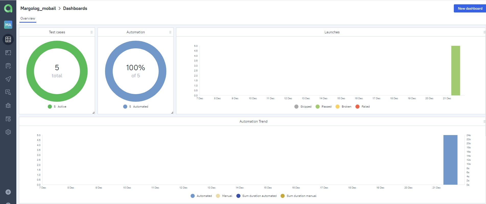
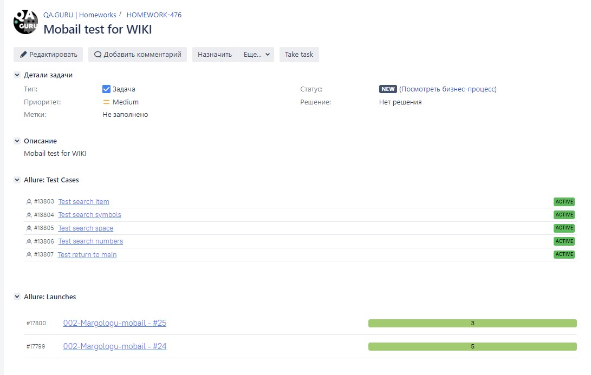
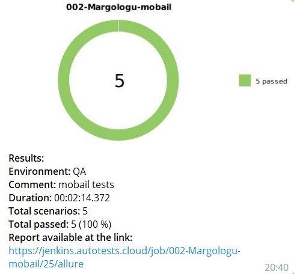

# Проект автоматизации тестирования для <a target="_blank" href="https://shop.spacex.com/">shop.spacex</a>

## :open_book: Содержание:
- [Технологии и инструменты](#gear-в-проекте-используются-следующие-технологии-и-инструменты)
- [Что проверяем](#heavy_check_mark-что-проверяем)
- [Запуск тестов из Jenkins](#-запуск-тестов-из-jenkins)
- [Отчеты](#bar_chart-отчеты-о-прохождении-тестов-доступны-в-allure)
- - [Allure](#-allure)
- - [Telegram](#-telegram)
- [Allure TestOps](#-проект-интегрирован-с-allure-testOps)

## :gear: В проекте используются следующие технологии и инструменты:

## :heavy_check_mark: Описание
В проекте автоматизирована проверка переходов на страницы shop.spacex.

## :heavy_check_mark: Что проверяем

> - Переход на страницу опалаты;
> - Переход на страницу вопросов;
> - Переход на страницу политики конфиденциальности;
> - Переход на страницу условий.

## Сборка в [Jenkins](https://jenkins.autotests.cloud/job/002-Margologu-UI/)

  

## Информация о тестах в [Allure report](https://jenkins.autotests.cloud/job/002-Margologu-UI/9/allure/)

  

### Окно с кейсами

  

#### Графики

  

## Интеграция с [Allure TestOps](https://allure.autotests.cloud/project/1760/dashboards)
### Тест-кейсы

  

### Дашборд

  

## Интеграция с Jira

  

## Уведомление в Telegram

  

